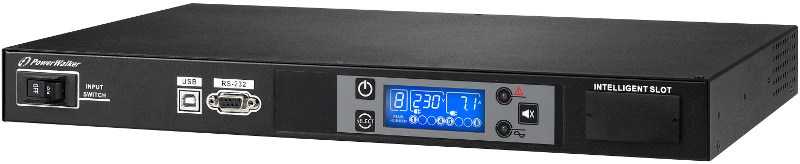
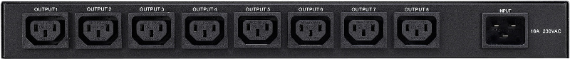

# About
There was no Linux software available for the PowerWalker PDU and ATS, but the [manufacturer](https://powerwalker.com/) was kind enough to supply me with what I needed to make my own library.


I'm using a Raspberry Pi as a power manager in my [homelab](https://www.thomasjensen.me/homelab/), it is connected to both the PDU and ATS. I use MQTT to communicate with it, and report power usage etc. to things like [Home Assistant](https://home-assistant.io/). For graphing I'll be storing values in [Elasticsearch](https://www.elastic.co/products/elasticsearch) and displaying the data using [Kibana](https://www.elastic.co/products/kibana).

**Beta!** This library is still very much in beta, and not all features are implemented yet.

## Communicate
Connect either the USB or the serial port, find the correct device path and instantiate:

```pyhton
import powerwalker

pdu = powerwalker.PDU("/dev/ttyUSB0")
ats = powerwalker.ATS("/dev/ttyUSB1")
```

# PowerWalker PDU RC-16A IEC



PowerWalker PDU RC-16A is designed to distribute AC power from a single source to 8 outputs with advanced load monitoring and local or remote ON/OFF switching control of individual outlets.

https://powerwalker.com/?lang=en&page=product&item=10133001

## Available methods
| Method | Description | Type |
| --- | --- | --- |
| `connect()` | Connect to PDU device. | - |
| `send(cmd)` | Send custom command. | - |
| `info()` | Get and return device information. | get |
| `status()` | Get and return device statuses. (see codes below) | get |
| `power_watt()` | Get and return active power measurements for input and all outputs. | get |
| `power_va()` | Get and return apparent power measurements for input and all outputs. | get |
| `power_kwh()` | Get and return power consumption for input and all outputs. | get |
| `power_kwh_clear()` | Clear power consumption values for input and all outputs. | **set** |
| `countdown_times()` | Get and return shutdown and restore countdown times for all outputs. | get |
| `shutdown(idx, shdn)` | Shutdown output `idx` in `shdn` minutes. | **set** |
| `shutdown_restore(idx, shdn, rst)` | Shutdown output `idx` in `shdn` minutes, restore power after `rst` minutes. | **set** |
| `shutdown_cancel(idx)` | Cancel pending shutdown on output `idx`. | **set** |
| `test()` | Test PDU device, turn on all LEDs and the buzzer for 5 seconds. | **set** |

### Output status codes
0. Off
1. On
2. Shutdown active
3. Shutdown imminent (S01-S08 code)
4. Restore active
5. Overload alarm (F01-F08 code)
6. Locked (L01-L08 code)

### Shutdown method arguments
* `idx` : output; `1` to `8`, `A` for all.
* `shdn` : shutdown delay in minutes; `.1` to `.9`, `01` to `99`, `00` for immediate.
* `rst` : restore delay in minutes; `0000` to `9999`, `0000` for 1 second.

## Example responses

### Generic
* `ACK` if command was accepted.
* `NAK` if command was **not** accepted.

### `info()`
```
{   'in_out_phase': '1/1',
    'in_socket_no': '1',
    'model': '############PDU',
    'nom_in_voltage': '230',
    'nom_out_voltage': '230',
    'out_socket_no': '8'}
```

### `status()`
```
{   'in_current': '01.4',
    'in_freq': '49.8',
    'in_voltage': '226.9',
    'int_temp': '35.0',
    'out1_current': '00.0',
    'out2_current': '00.3',
    'out3_current': '00.0',
    'out4_current': '00.3',
    'out5_current': '00.1',
    'out6_current': '00.2',
    'out7_current': '00.2',
    'out8_current': '00.0',
    'status': {   'a01_low_in_voltage': '0',
                  'a02_high_in_voltage': '0',
                  'f09_low_in_current': '0',
                  'f10_high_in_current': '0',
                  'f11_pwr_fail_aux1': '0',
                  'f12_pwr_fail_aux2': '0',
                  'na_b8': '0',
                  'na_b9': '0',
                  'out1_status': '1',
                  'out2_status': '1',
                  'out3_status': '1',
                  'out4_status': '1',
                  'out5_status': '1',
                  'out6_status': '1',
                  'out7_status': '1',
                  'out8_status': '1'}}
```

### `power_watt()`
```
{   'in_w': '0249',
    'out1_w': '0000',
    'out2_w': '0042',
    'out3_w': '0000',
    'out4_w': '0083',
    'out5_w': '0000',
    'out6_w': '0043',
    'out7_w': '0031',
    'out8_w': '0000'}
```

### `power_va()`
```
{   'in_va': '0338',
    'out1_va': '0000',
    'out2_va': '0079',
    'out3_va': '0000',
    'out4_va': '0090',
    'out5_va': '0036',
    'out6_va': '0049',
    'out7_va': '0063',
    'out8_va': '0000'}
```

### `power_kwh()`
```
{   'in_kwh': '000702.2',
    'out1_kwh': '000000.0',
    'out2_kwh': '000101.0',
    'out3_kwh': '000011.8',
    'out4_kwh': '000110.7',
    'out5_kwh': '000198.9',
    'out6_kwh': '000104.0',
    'out7_kwh': '000046.3',
    'out8_kwh': '000019.8'}
```

### `countdown_times()`
```
{   'out1_cd_sec': {'r': '000000', 's': '0000'},
    'out2_cd_sec': {'r': '000000', 's': '0000'},
    'out3_cd_sec': {'r': '000000', 's': '0000'},
    'out4_cd_sec': {'r': '000000', 's': '0000'},
    'out5_cd_sec': {'r': '000000', 's': '0000'},
    'out6_cd_sec': {'r': '000000', 's': '0000'},
    'out7_cd_sec': {'r': '000000', 's': '0000'},
    'out8_cd_sec': {'r': '000000', 's': '0000'}}
```

# PowerWalker ATS


ATS (Automatic Transfer Switch) supports connection of two independent power sources. If primary power source fails, the secondary will automatically back up the connected load without any interruption. 

https://powerwalker.com/?page=product&item=10120543&lang=en

## Available methods
| Method | Description | Type |
| --- | --- | --- |
| `connect()` | Connect to PDU device. | - |
| `send(cmd)` | Send custom command. | - |
| `info()` | Get and return device information. | get |
| `status()` | Get and return device statuses. | get |

> Changing perferred input not (yet?) implemented.

## Example responses

### `info()`
```
{   'int_temp': '35.0',
    'out_current': '001.6',
    'out_load_pct': '010',
    'src1_freq': '50.0',
    'src1_voltage': '229.7',
    'src2_freq': '50.0',
    'src2_voltage': '229.7',
    'sync_angle': '001'}
```

### `status()`
```
{   'status': {   'aux_pwr1_fail': '0',
                  'aux_pwr2_fail': '0',
                  'na_c0': '0',
                  'na_c1': '0',
                  'na_c2': '0',
                  'na_c3': '0',
                  'na_c4': '0',
                  'na_c5': '0',
                  'na_c6': '0',
                  'na_c7': '0',
                  'on_fault_mode': '0',
                  'on_src1': '1',
                  'on_src2': '0',
                  'overload_alarm': '0',
                  'overload_fault': '0',
                  'preferred_src2': '0',
                  'short_fault': '0',
                  'src1_freq_bad': '0',
                  'src1_voltage_bad': '0',
                  'src1_wave_bad': '0',
                  'src2_freq_bad': '0',
                  'src2_voltage_bad': '0',
                  'src2_wave_bad': '0',
                  'syncron_bad': '0'}}
```

# CLI
For easy access to the device methods; use `cli.py`:

    python3 cli.py device method arguments

## Examples
Run test sequence on PDU:

    python3 cli.py pdu test

Shutdown output 8 in 0.5 minutes:

    python3 cli.py pdu shutdown 8 .5

Shutdown output 8 in 2 minutes, restore after 1 second:

    python3 cli.py pdu shutdown_restore 8 02 0000

Cancel pending shutdown on output 8

    python3 cli.py pdu shutdown_cancel 8

# Script files
* `cli.py`: Simple command line interface
* `info.py`: Get and print device information.
* `mqtt.py`: Publishing values to a MQTT broker.
* `pdu_power.py`: Get real & apparent power and consumption from the PDU.
* `status.py`: Get and print statuses.

# Author
[Thomas Jensen](https://www.thomasjensen.me/)

# Notices
* PowerWalker is a brand of BlueWalker GmbH.
* PowerWalker PDU RC-16A IEC and PowerWalker ATS are products of BlueWalker GmbH.
* This library is published under the [MIT license](LICENSE).
