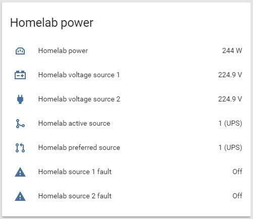

# Home Assistant examples
I am using [Home-Assistant](https://home-assistant.io/) to show data from my ATS and PDU, here is some of my config.



## Sensors
```yml
sensor:
  - platform: mqtt
    state_topic: 'homelab/power/supply'
    name: Homelab power
    unit_of_measurement: 'W'
  - platform: mqtt
    state_topic: 'homelab/power/desktop'
    name: Workstation power
    unit_of_measurement: 'W'
  - platform: mqtt
    state_topic: 'homelab/voltage/src1'
    name: Homelab voltage source 1
    unit_of_measurement: 'V'
  - platform: mqtt
    state_topic: 'homelab/voltage/src2'
    name: Homelab voltage source 2
    unit_of_measurement: 'V'
  - platform: template
    sensors:
      homelab_preferred:
        friendly_name: 'Homelab preferred source'
        value_template: >-
          
            2 (Bypass)
          
            1 (UPS)
          
      homelab_source:
        friendly_name: 'Homelab active source'
        value_template: >-
          
            2 (Bypass)
          
            1 (UPS)
          
            fail
          

binary_sensor:
  - platform: mqtt
    name: "Homelab on source 1"
    state_topic: "homelab/voltage/on_src1"
    payload_on: "1"
    payload_off: "0"
  - platform: mqtt
    name: "Homelab on source 2"
    state_topic: "homelab/voltage/on_src2"
    payload_on: "1"
    payload_off: "0"
  - platform: mqtt
    name: "Homelab source 2 preferred"
    state_topic: "homelab/voltage/preferred_src2"
    payload_on: "1"
    payload_off: "0"
  - platform: mqtt
    name: "Homelab source 1 fault"
    state_topic: "homelab/voltage/src1_bad"
    payload_on: "1"
    payload_off: "0"
  - platform: mqtt
    name: "Homelab source 2 fault"
    state_topic: "homelab/voltage/src2_bad"
    payload_on: "1"
    payload_off: "0"
  - platform: template
    sensors:
      workstation_on:
        friendly_name: "Workstation"
        value_template: "{{ states.sensor.workstation_power.state | int > 0 }}"
        delay_off: 2
```

### Automations
```yml
- alias: Homelab supply fault
  hide_entity: False
  trigger:
    - platform: state
      entity_id: binary_sensor.homelab_source_1_fault
      to: 'on'
    - platform: state
      entity_id: binary_sensor.homelab_source_2_fault
      to: 'on'
  action:
    - service: notify.pushover_notify
      data:
        title: "Homelab supply fault"
        message: 'Or, or more, of the supply sources on homelab has failed!'
        data:
          priority: 2
```
